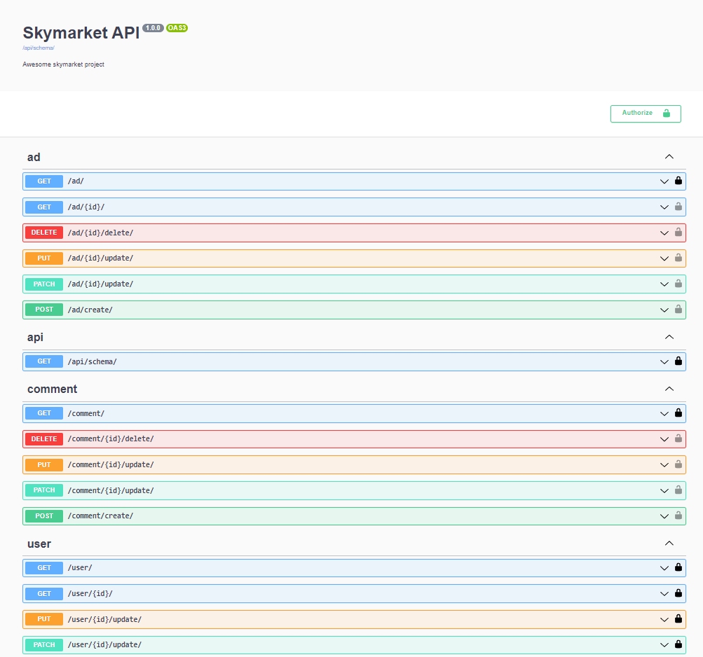

# Курсовой проект Django
программирования на Python (ISA)

### Фронтенд запустить не получилось, написал только бекенд с нуля, все проверялось в Postman !
### в настройках БД ничего менять не надо!!!   POSTGRES Задеплоин на VDS 

Бэкенд-часть проекта  реализацию следующего функционала:

- Авторизация и аутентификация пользователей.
- Распределение ролей между пользователями (пользователь и админ).
- Восстановление пароля через электронную почту (не обязательно).
- CRUD для объявлений на сайте (админ может удалять или редактировать все объявления, а пользователи только свои).
- Под каждым объявлением пользователи могут оставлять отзывы.
- В заголовке сайта можно осуществлять поиск объявлений по названию.

POST /user/token/

    {
    "username": "admin@skypro.ru",
    "password": "111"
    }
 

http://127.0.0.1:8000/api/schema/swagger-ui/
-----------------------------------------------------------------------------------

### Откройте склонированный репозиторий в PyCharm.
https://github.com/GeeN33/Django_Homework_1.git
### установите из файла список внешних зависимостей и библиотеки
- requirements.txt
- pip install -r requirements.txt
- pip freeze > requirements.txt

### Cоздайте виртуальное окружение:

#### Простой вариант:
Pycharm может предложить вам сделать это после того, как вы откроете папку с проектом.
В этом случае после открытия папки с проектом в PyCharm
Появляется всплывающее окно, Creating virtuan envrironment c тремя полями.
В первом поле выбираем размещение папки с вирутальным окружением, как правило это папка venv
в корне проекта
Во втором поле выбираем устанавливаемый интерпритатор по умолчанию (можно оставить без изменений)
В 3 поле выбираем список зависимостей (должен быть выбран фаил requirements.txt, находящийся в корне папки проекта)

#### Если этого не произошло, тогда следует выполнить следующие действия вручную:
#### Установка виртуального окружения:
1. Во вкладке File выберите пункт Settings
2. В открывшемся окне, с левой стороны найдите вкладку с именем
вашего репозитория (Project: lesson23-and-tests)
3. В выбранной вкладке откройте настройку Python Interpreter
4. В открывшейся настройке кликните на значек ⚙ (шестеренки) 
расположенный сверху справа и выберите опцию Add
5. В открывшемся окне слева выберите Virtualenv Environment, 
а справа выберите New Environment и нажмите ОК

#### Установка зависимостей:
Для этого можно воспользоваться графическим интерфейсом PyCharm,
который вам предложит сделать это как только вы откроете файл с заданием.

Или же вы можете сделать это вручную, выполнив следующую команду в терминале:
`pip install -r requirements.txt`

#### Настройка виртуального окружения завершена!

